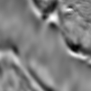
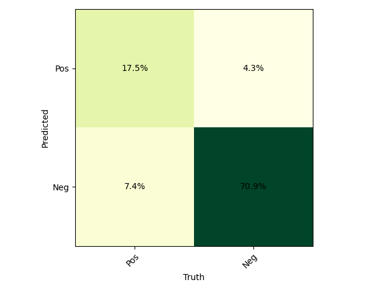
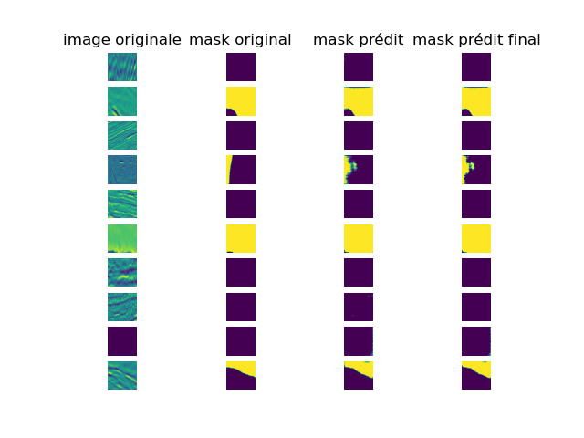

# Semantic Segmentation
## Introduction
Study project on Semantic segmentation, subject can be found [here](https://docs.google.com/document/d/1sbqmVY4H_FXkWiGUhXTxQqwH9pGkD-1YSO64tkrLf38/edit#heading=h.cn9facwy6g3m). 
Basically we start from the salt identification challenge on kaggle [here](https://www.kaggle.com/c/tgs-salt-identification-challenge/data) and try to resolve it with implementations of Unet.

## Data
The data is separated into a base image and a mask representing which pixels in the image contain salt. The goal is to predict the mask given an image  
 

## Results
The main results can be found in the "semantic segmentation" notebook and resulting models and their results are saved under the "/models" folder.
We used a unet similar to this one:  
 to solve this. Image were first resized to 128 x 128 to fit the model inputs and outputs. 
After 40 epoch on training dataset our best results are:  
**loss: 0.65 precision: 0.8, recall: 0.7, accuracy: 0.88, f1 score: 0.75**  
(to define TP, FP... we simply compare for each pixel of the predicted mask if was indeed predicted as intended)  
with a confusion matrix as following:  
  
and here are some exemples of the results predicted  

